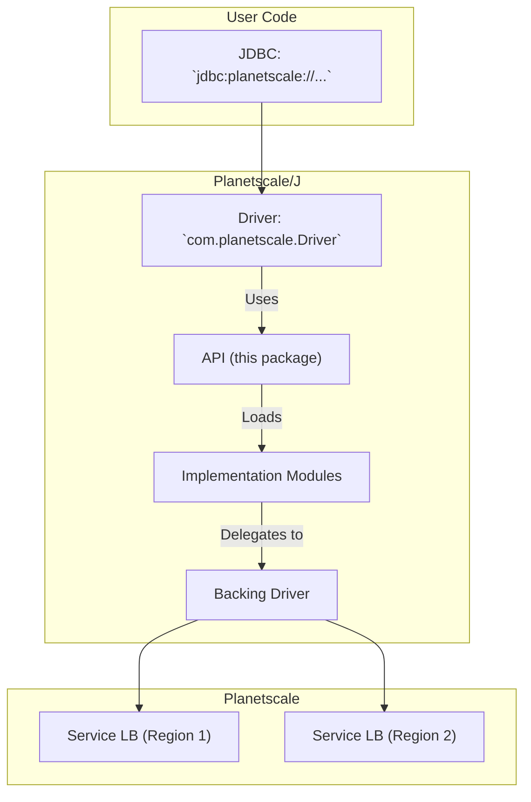

## Planetscale/J: Core API

This package provides API definitions for the Planetscale/Java connector. It is not meant for direct consumption
by end-users; see the [`impl-h2`][1] package for a reference implementation, and the [`impl-mysqlj`][2] package
for the main implementation used by the real driver.

### Architecture

This library uses as few dependencies as possible, and exposes its own interfaces and [Service Loader][3]-based
mechanism for resolving the appropriate implementation to use.

Then, these powers combine to form the actual driver, which is exported in a POM-only module called [`driver`][4].
Users install that package to automatically pull in the appropriate API and implementation.

### Limitations

At the moment, it is intentional that only one implementation may be loaded and used at any given time. Later, this may
become configurable, at which time this restriction will be lifted.

### Available Implementations

- **[H2][6]:** Designed for speed, and used for testing the adapter interface independent of MySQL.
- **[MySQL/J][7]:** The main implementation, which uses the official MySQL JDBC driver under the hood.

### Writing an Implementation

The interface to implement is [`PlanetscaleAdapter`][5], which is in charge of adapting JDBC to a driver implementation
of some kind, and has the chance to override various JDBC behaviors.

More abstract implementations are anticipated for the future.

[1]: ../impl-h2
[2]: ../impl-mysqlj
[3]: https://docs.oracle.com/javase/8/docs/api/java/util/ServiceLoader.html
[4]: ../driver
[5]: src/main/jvm/com/planetscale/jvm/PlanetscaleAdapter.kt
[6]: ../impl-h2
[7]: ../impl-mysqlj
